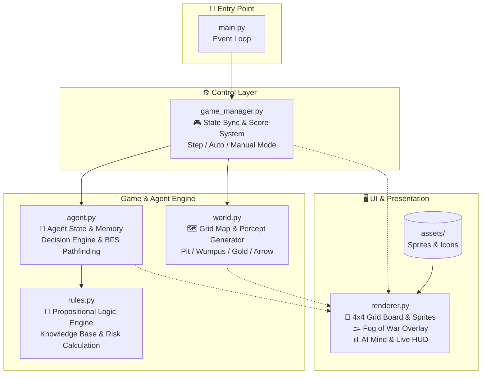

# 🧠 Agentic Wumpus World

### 불확실한 환경에서 살아남는 AI Agent

격자형 동굴 환경(4×4 Grid)에서 AI Agent가 **Breeze, Stench, Glitter, Scream** 등의 환경 신호(Percept)를 수집하여 지식 베이스(Knowledge Base)를 갱신하고, 명제 논리(Propositional Logic)와 BFS 탐색을 통해 안전한 경로를 추론하여 **Gold를 획득하고 무사히 탈출**하는 Agentic AI 프로젝트입니다.

---

## 📂 프로젝트 구조

```text
wumpus-world/
├── main.py                  # 🚀 프로그램 진입점 및 이벤트 루프
├── requirements.txt         # 📦 의존성 패키지 (Pygame 2.6.1)
├── game/                    # 🎮 핵심 게임 로직 & AI 엔진
│   ├── agent.py             # 🤖 AI Agent 클래스 (Perception, Memory, Decision, BFS)
│   ├── rules.py             # 📜 명제 논리 추론 엔진 (Knowledge Base & Risk Evaluation)
│   ├── world.py             # 🗺️ 4x4 던전 환경, 위험 요소(Pit/Wumpus), 지각 신호 생성
│   └── game_manager.py      # ⚙️ 게임 흐름 동기화, 점수 계산 및 게임 모드 제어
├── ui/                      # 🖥️ UI & 오디오 렌더링
│   ├── renderer.py          # 🎨 Pygame 기반 2D 그래픽, Fog of War, 실시간 AI Mind HUD
│   └── sound_manager.py     # 🔊 저지연 오디오 시스템 (Breeze, Stench, Glitter, Scream, Door, Pit, Wumpus, Gold)
└── assets/                  # 🖼️ 고화질 2D 스프라이트 및 사운드 에셋
    ├── hero.png, door.png, floor.png, wumpus.png, pit.png, gold.png...
    └── sounds/              # 🎵 16-bit PCM WAV 사운드 이펙트
        ├── breeze.wav, stench.wav, glitter.wav, scream.wav, door.wav, pit.wav, wumpus.wav, gold.wav
```

| 모듈 / 파일            | 역할                                                                                              |
| :--------------------- | :------------------------------------------------------------------------------------------------ |
| `main.py`              | 🚀 Pygame 초기화, 윈도우 생성, 키보드 이벤트 분기 및 메인 루프 실행                               |
| `game/world.py`        | 🗺️ 4×4 맵 생성(기본 맵/랜덤 맵), Pit/Wumpus/Gold 배치, 화살 궤적 계산 및 Percept 발생             |
| `game/agent.py`        | 🤖 AI Agent 상태 관리, 인지-추론-행동 루프, 에피소드 사망 기억(Episodic Memory), BFS 최단 경로 탐색 |
| `game/rules.py`        | 📜 명제 논리 기반 지식 추론, 과거 실패 기억 통합(`death_memory`), 위험도 점수(`Risk Score`) 산출   |
| `game/game_manager.py` | ⚙️ World와 Agent 상호작용 동기화, 사망 원인 기록(`record_death`), Replay 메모리 보존 제어          |
| `ui/renderer.py`       | 🖥️ 전장 그리드, 시야 안개(Fog of War), AI 사고 과정(Thought Process) 및 HUD 실시간 렌더링         |
| `ui/sound_manager.py`  | 🔊 지각 신호(Breeze/Stench/Glitter), 탈출(Door), 사망(Pit/Wumpus), 비명(Scream) 저지연 오디오 재생 엔진 |
| `assets/`              | 🎨 던전 타일, 캐릭터, 몬스터, 지각 신호 스프라이트 및 효과음(.wav) 리소스                           |

---

## 🏗️ Architecture



---

## 🎮 Game Concept & Rules

AI Agent는 동굴을 탐험하며 각 칸에서 감각 정보(**Percept**)를 획득하고, 이를 바탕으로 위험을 피해 임무를 완수해야 합니다.

### 1. 환경 지각 신호 (Percepts) & 객체

| 아이콘 / 요소 | 명칭                   | 의미 및 규칙                                                            |
| :-----------: | :--------------------- | :---------------------------------------------------------------------- |
|      🌬️       | **Breeze (바람)**      | 상/하/좌/우 인접 칸에 Pit(함정)이 존재함을 감지                         |
|      👃       | **Stench (악취)**      | 상/하/좌/우 인접 칸에 Wumpus(괴물)가 살아있음을 감지                    |
|      ✨       | **Glitter (반짝임)**   | 현재 위치한 칸에 Gold(금괴)가 존재함                                    |
|      😱       | **Scream (비명)**      | Agent가 쏜 화살에 Wumpus가 명중하여 처치되었을 때 동굴 전체에 울려 퍼짐 |
|      🚪       | **Door / Exit (입구)** | (3, 0) 위치. Gold를 획득한 후 이곳으로 돌아와 탈출(`CLIMB`)하면 승리    |
|      ❌       | **Pit (함정)**         | 빠지면 즉시 사망 및 게임 오버 (-1000점)                                 |
|      👹       | **Wumpus (괴물)**      | 마주치면 즉시 사망 및 게임 오버 (-1000점). 화살로 사냥 가능             |
|      🏹       | **Arrow (화살)**       | Agent가 단 1발 보유. 직선 경로로 날아가 Wumpus를 제거                   |

### 2. 점수 규칙 (Scoring System)

- **Gold 획득 후 무사 탈출 (Victory)**: `+1,000점`
- **매 행동당 이동 비용 (Step Penalty)**: `-1점`
- **화살 발사 비용 (Shoot Arrow)**: `-10점`
- **Pit 추락 또는 Wumpus에 피격 (Game Over)**: `-1,000점`

---

## 🤖 AI Agent 추론 및 결정 메커니즘

Agent는 불확실한 부분 관측 환경(POMDP)에서 다음과 같은 **5단계 인지 순환 루프**를 거쳐 행동합니다.

```text
[ 1. Perception ]  -->  [ 2. Memory Update ]  -->  [ 3. Logic Deduction ]
                                                            │
[ 5. Action Execution ]  <--  [ 4. Decision & Pathfinding ]  ┘
```

### 1. 명제 논리 지식 베이스 (Knowledge Base)

- **Safe Cells ($Safe = PitFree \cap WumpusFree$)**:
  - Breeze가 없는 방문 셀의 인접 칸은 모두 **Pit-Free**.
  - Stench가 없는 방문 셀의 인접 칸은 모두 **Wumpus-Free** (Wumpus 사망 시 전체 맵이 Wumpus-Free).
- **Wumpus 위치 확정 (Single Wumpus Assumption)**:
  - Wumpus는 세계에 단 1마리만 존재하므로, 감지된 Stench들의 후보군 교집합(Intersection) 크기가 1이 되는 순간 Wumpus의 좌표가 확정됩니다.
- **Pit 위치 확정**:
  - Breeze가 감지된 셀의 미방문 인접 셀 중, Pit-Free가 아닌 후보 셀이 1개만 남으면 해당 셀은 100% Pit으로 확정됩니다.

### 2. 행동 우선순위 (Decision Hierarchy)

1. **Gold 획득 (`GRAB`)**: 현재 칸에 Glitter 감지 시 즉시 금괴 획득.
2. **귀환 및 탈출 (`CLIMB`)**: Gold 소지 시, 기방문 안전 경로(BFS)를 통해 출발점 `(3, 0)`으로 복귀 후 동굴 탈출.
3. **안전 구역 탐색 (`EXPLORE_SAFE`)**: 확정된 안전 미방문 셀 중 가장 가까운 목표로 안전 경로(BFS) 탐색 후 이동.
4. **Wumpus 조준 사격 (`SHOOT`)**: Wumpus의 위치가 확정되고 화살이 남아있다면, 사선(가로/세로 일직선)에 위치한 안전 칸으로 재배치 후 화살 발사.
5. **계산된 위험 감수 (`CALCULATED_RISK`)**: 100% 안전한 미탐색 칸이 없는 경우, 인접 셀의 위험 점수(Risk Score)를 비교하여 위험 확률이 가장 낮은 셀로 이동 (과거 사망 칸은 배제).
6. **안전 후퇴 (`RETREAT`)**: 진입로가 완전히 차단된 경우, 무리하지 않고 출발점으로 안전하게 후퇴하여 생존.

### 3. 🧠 에피소드 사망 기억 및 적응 학습 (Episodic Memory & Failure Learning)

동일 맵을 다시 플레이할 때 Agent가 같은 실수를 반복하지 않도록 **Cross-Episode Death Memory** 메커니즘을 지원합니다.


- **사망 원인 학습 (`record_death`)**:
  - **Pit 추락 (`FALL_IN_PIT`)**: 사망한 좌표 `(r, c)`를 `confirmed_pits`로 즉시 각인.
  - **Wumpus 피격 (`EATEN_BY_WUMPUS`)**: 사망한 좌표 `(r, c)`를 `confirmed_wumpus`로 각인하여 다음 판에서 원거리 저격 기회를 모색.
- **Replay 적응 (`[R]`)**:
  - Replay 시 지각/이동 기록은 초기화되지만, 해당 맵에서 학습한 `death_memory`는 유지됩니다.
  - 100% 안전한 셀이 없어 위험을 감수해야 할 때, **이전에 죽었던 셀을 우선순위에서 완전히 제외**하고 다른 대체 분기 경로로 우회합니다.
- **메모리 수명 주기 (Lifecycle)**:
  - `[R] Replay`: 현재 맵의 사망 기억 유지 (반복 학습).
  - `[M] Random Map` / `[D] Default Map`: 다른 세계로 이동하므로 사망 기억 완전 초기화 (`clear_death_memory`).

---

## 🖥️ UI & Visualization 기능

Pygame 기반으로 제작된 인터페이스는 직관적인 정보 전달과 몰입감을 제공합니다.

- **동적 안개 시스템 (Fog of War)**: 미탐색 셀은 어두운 안개로 가려지며, Agent가 안전하다고 추론한 셀은 **녹색 테두리와 `SAFE` 배지**로 실시간 표시됩니다. 확정된 위험 지역(사망 기억 포함)은 `PIT!`, `WUMPUS!` 경고 태그가 부착됩니다.
- **AI 실시간 사고 패널 (Thought Process)**: AI가 현재 왜 이 칸으로 이동하는지, 과거 사망 기억을 어떻게 회피하고 있는지 실시간 텍스트로 표시합니다.
- **지식 베이스 통계 (Knowledge Dashboard)**:
  - 발견한 안전 구역 수 (`Safe Cells: X/16`), 방문 구역 수 (`Visited: Y/16`)
  - 확정된 함정 수 (`Pits Confirmed: N`), Wumpus 추적 상태 (`Hunting` / `At (r,c)` / `Slain`)
- **실시간 감각 아이콘 (Percepts Badge)**: 현재 발을 디딘 셀에서 느껴지는 바람, 악취, 반짝임 신호를 전용 스프라이트 뱃지로 표시.

---

## ⌨️ 조작 키 안내 (Controls)

|                      키 (Key)                       | 기능                              | 설명                                                                |
| :-------------------------------------------------: | :-------------------------------- | :------------------------------------------------------------------ |
|                  <kbd>SPACE</kbd>                   | **AI 1단계 실행**                 | AI Agent가 다음 1단계를 추론하고 행동합니다.                        |
|                    <kbd>A</kbd>                     | **자동 실행 모드 (Auto Mode)**    | 400ms 딜레이 간격으로 AI가 스스로 연속 탐색합니다.                  |
|                   <kbd>TAB</kbd>                    | **안개 제거 / 복원 (Fog Toggle)** | Fog of War를 토글하여 전체 맵의 실제 정답 상태를 확인합니다.        |
|                    <kbd>R</kbd>                     | **현재 맵 재시작 (Replay Map)**   | 동일한 맵 레이아웃을 다시 플레이하며, **사망 기억(Episodic Memory)을 계승**하여 새로운 경로를 개척합니다. |
|                    <kbd>M</kbd>                     | **랜덤 맵 생성 (New Random Map)** | 신규 맵을 생성하며 기존 사망 기억을 완전히 초기화(Wipe)합니다.       |
|                    <kbd>D</kbd>                     | **기본 맵 로드 (Default Map)**    | 표준 기본 맵을 로드하며 기존 사망 기억을 완전히 초기화(Wipe)합니다. |
| <kbd>↑</kbd> <kbd>↓</kbd> <kbd>←</kbd> <kbd>→</kbd> | **수동 조작 (Manual Move)**       | 사용자가 직접 상하좌우로 이동하여 AI와 플레이를 비교할 수 있습니다. |
| <kbd>Shift</kbd> + <kbd>↑</kbd> <kbd>↓</kbd> <kbd>←</kbd> <kbd>→</kbd> | **수동 활 쏘기 (Manual Shoot)** | 해당 방향으로 화살을 발사하여 Wumpus를 공격합니다. (1회 제한) |
|                    <kbd>G</kbd>                     | **수동 줍기 (Manual Grab)**       | 현재 위치한 칸의 Gold를 수동으로 획득합니다.                        |
|                    <kbd>C</kbd>                     | **수동 탈출 (Manual Climb)**      | 입구 (3, 0)에서 동굴 밖으로 탈출하여 게임을 완료합니다.             |

---

## 🛠️ Tech Stack

| 기술                | 용도              | 설명                                                        |
| :------------------ | :---------------- | :---------------------------------------------------------- |
| 🐍 **Python 3.10+** | Core Logic        | 게임 환경 및 AI Agent 구현                                  |
| 🎮 **Pygame 2.6.1** | Graphics & Audio  | 60 FPS 2D 하드웨어 가속 렌더링 및 입력 이벤트 처리          |
| 🧠 **Symbolic AI**  | Knowledge & Logic | 명제 논리(Propositional Logic), 지식 베이스 추론            |
| 🧭 **Algorithms**   | Pathfinding       | BFS(너비 우선 탐색) 최단 경로 알고리즘, Risk Score 휴리스틱 |

---

## 🚀 실행 방법

### 1. 저장소 클론 (Clone Repository)

```bash
git clone https://github.com/OnlyDev321/wumpus-world.git
cd wumpus-world
```

### 2. 가상환경 생성 및 활성화

**macOS / Linux**

```bash
python3 -m venv .venv
source .venv/bin/activate
```

**Windows**

```bash
python -m venv .venv
.venv\Scripts\activate
```

### 3. 패키지 설치

```bash
pip install -r requirements.txt
```

### 4. 프로그램 실행

```bash
python main.py
```

---

## 🎯 Project Goal

이 프로젝트의 핵심 목표는 단순한 2D 미니게임을 넘어,

> **"불확실한 환경(Partial Observability) 속에서 지각(Perceive)하고, 기억(Memory)하며, 논리적으로 추론(Reason)하여 최적의 생존 및 목표 행동(Action)을 결정하는 Agentic AI의 근본 원리를 구현하고 시각화하는 것"**

입니다.
