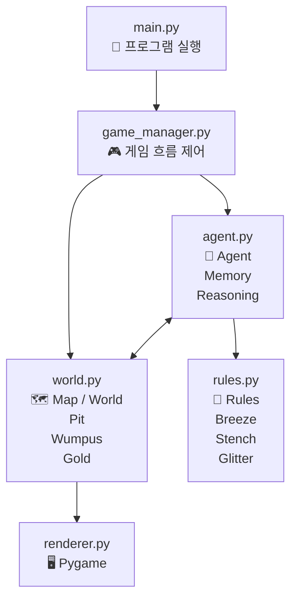

# 🧠 Agentic Wumpus World

### 불확실한 환경에서 살아남는 AI Agent

격자형 동굴 환경에서 AI Agent가 **Breeze, Stench, Glitter** 등의 정보를 바탕으로 주변 환경을 추론하고, 안전한 경로를 찾아 **Gold**를 획득하는 프로젝트입니다.

---

## 📂 프로젝트 구조

| 파일              | 역할                                   |
| :---------------- | :------------------------------------- |
| `main.py`         | 🚀 프로그램 실행                       |
| `world.py`        | 🗺️ 맵 + Pit + Wumpus + Gold 관리       |
| `agent.py`        | 🤖 Agent + Memory + Reasoning          |
| `rules.py`        | 📜 Breeze / Stench / Glitter 규칙 관리 |
| `game_manager.py` | 🎮 게임 진행 흐름 제어                 |
| `renderer.py`     | 🖥️ Pygame을 이용한 게임 화면 렌더링    |

---

## 🏗️ Architecture



---

## 🎮 Game Concept

Agent가 동굴을 탐험하면서 주변의 환경 정보(**Percept**)를 관찰합니다.

| Percept        | 의미                               |
| :------------- | :--------------------------------- |
| 🌬️ **Breeze**  | 인접한 칸에 Pit이 존재할 가능성    |
| 👃 **Stench**  | 인접한 칸에 Wumpus가 존재할 가능성 |
| ✨ **Glitter** | 현재 위치에 Gold가 존재            |
| ❌ **Pit**     | Agent가 빠지면 게임 종료           |
| 👹 **Wumpus**  | 만나면 게임 종료                   |
| 🪙 **Gold**    | 획득하면 게임 성공                 |

---

## 🤖 Agent Flow

```text
        Environment
             │
             ▼
        Perception
             │
             ▼
       Agent Memory
             │
             ▼
         Reasoning
             │
             ▼
       Action Decision
             │
             ▼
        Move / Grab
             │
             ▼
        Environment
```

Agent는 현재 위치에서 얻은 정보를 **Memory**에 저장하고, `rules.py`의 규칙을 이용하여 주변 칸의 위험성을 추론합니다.

---

## 🛠️ Tech Stack

| Technology        | Purpose                           |
| :---------------- | :-------------------------------- |
| 🐍 **Python**     | Backend / Agent Logic             |
| 🎮 **Pygame**     | 2D Game Rendering                 |
| 🤖 **Agentic AI** | Agent Reasoning & Decision Making |

---

## 🚀 실행 방법

### 1. 프로젝트 클론

```bash
git clone https://github.com/OnlyDev321/wumpus-world.git
```

### 2. 프로젝트 이동

```bash
cd wumpus-world
```

### 3. 가상환경 생성

```bash
python -m venv .venv
```

### 4. 가상환경 활성화

**macOS / Linux**

```bash
source .venv/bin/activate
```

**Windows**

```bash
.venv\Scripts\activate
```

### 5. 필요한 패키지 설치

```bash
pip install -r requirements.txt
```

### 6. 프로그램 실행

```bash
python main.py
```

---

## 🎯 Project Goal

이 프로젝트의 목표는 단순한 2D 게임을 만드는 것이 아니라,

> **AI Agent가 불확실한 환경에서 관찰 → 기억 → 추론 → 행동하는 과정을 구현하는 것**

입니다.

---

## 📌 Core Concepts

```text
Perception
     ↓
Memory
     ↓
Reasoning
     ↓
Decision
     ↓
Action
     ↓
New Perception
```

이러한 구조를 통해 **Agentic AI의 기본적인 동작 원리**를 간단한 Wumpus World 환경에서 구현합니다.
